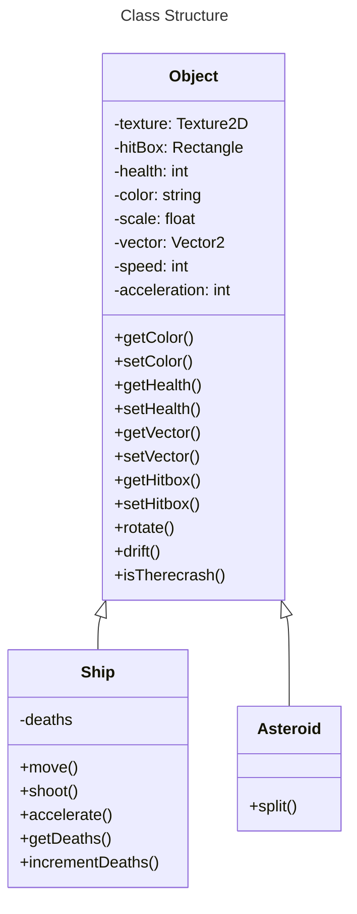

## Asteroids Clone Class Diagram

```mermaid
---
title: Class Structure
---
classDiagram

    Object <|-- Ship
    Object <|-- Asteroid


class Object{
        -texture: Texture2D
        -hitBox: Rectangle
        -health: int
        -color: string
        -scale: float  
        -vector: Vector2
        -speed: int 
        -acceleration: int
        +getColor()
        +setColor()
        +getHealth()
        +setHealth()
        +getVector()
        +setVector()
        +getHitbox()
        +setHitbox()
        +rotate()
        +drift()
        +isTherecrash()

    }
    class Ship{
        -deaths
        +move()
        +shoot()
        +accelerate()
        +getDeaths()
        +incrementDeaths()

    }
        class Asteroid{
            +split()
    }


```